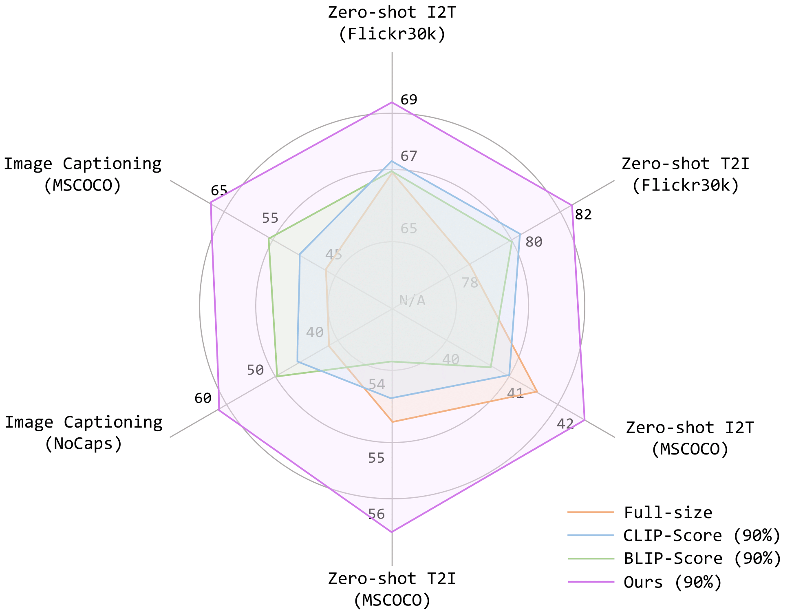

# Compress-Align

<p align="center">
   📃 <a href="https://arxiv.org/abs/2312.06726" target="_blank">Paper</a> • 🖼 <a href="https://huggingface.co/datasets/yusalei/COCO-HF" target="_blank">Dataset</a> <br>
</p>

**Compress & Align: Curating Image-Text Data with Human Knowledge**


<body>
<p align="center">
  
</p>
<p align="center">
  A diagram illustrating the three steps of our method to curating image-text data with human knowledge.
</p>
</body>

## News

**[2024.3.22]** The code and data will be coming soon.

## Introduction

The massive growth of image-text data through web crawling inherently presents the challenge of variability in data quality. This paper introduces a novel algorithm, rooted in human knowledge, to compress this vast corpus
of web-crawled image-text datasets to a compact and high-quality form. Our method unfolds in three major steps. First, we collect an image-text dataset, wherein each image is associated with multiple captions sourced from diverse origins. Then, to systemically capture human preferences regarding the best caption paired with each image, we establish a comprehensive set of both subjective and objective criteria for critically guiding the alignment assessment from labelers. Lastly, we train a reward model on the annotated dataset to internalize the nuanced human understanding of image-text alignment. The resulting reward model thus can act as a human-like referee to filter misaligned/low-quality image-text pairs. 

Extensive experiments demonstrate that we are able to secure (or even improve) model performance by compressing the image-text datasets up to ∼90%. An impressive example is that, by aggressively reducing the total training sample from 130M to 15.5M (e.g., ∼9× smaller), our BLIPB/16 models still consistently show superior performance compared with the full-size-dataset counterpart on image-text retrieval (Flickr30K, COCO) by ∼2.5% in Recall@1, and on image-captioning (Nocaps, COCO) by ∼10.0% in CIDEr and ∼2.7% in SPICE.

<p align="center">
  
</p>

## Acknowledgement

We are also very grateful that this work is supported by a gift from TPU Research Cloud (TRC) program and Google Cloud Research Credits program.

## Citation

```
@article{zhang2023compress,
  title={Compress & Align: Curating Image-Text Data with Human Knowledge},
  author={Lei Zhang and Fangxun Shu and Sucheng Ren and Bingchen Zhao and Hao Jiang and Cihang Xie},
  journal={arXiv preprint arXiv:2312.06726},
  year={2023}
}
```
